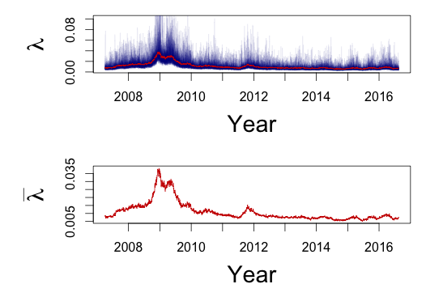
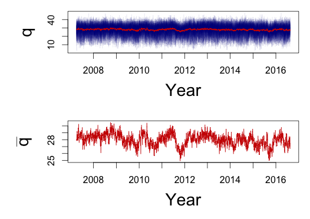
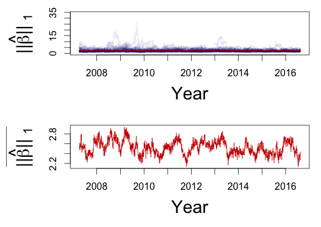
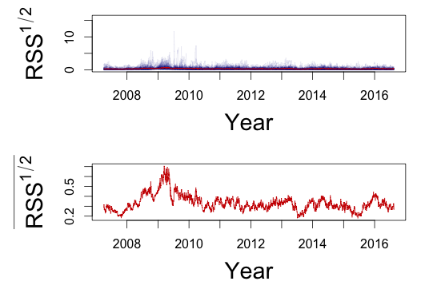

[](http://quantlet.de/)

## [](http://quantlet.de/) **XFGTVP_FRM** [](http://quantlet.de/)

```yaml

Name of Quantlet : XFGTVP_FRM

Published in : Applied Quantitative Finance (3rd Edition)

Description : 'Performs quantile LASSO regression in a moving window by using BIC and GACV criteria
to choose penalty parameter (lambda). The input data are daily logarithmic stock returns of 200
largest U.S. financial companies and 6 macro variables. Each of the selected companies is taken as
a dependent variable and is regressed by means of linear quantile regression with L1-penalty term
on the remaining ones together with the macro variables. Plots time series of lambda in quantile
LASSO regression. Furthermore, the cardinality of the active set q, the L2-norm of the residuals
and the L1-norm of the parameter beta are plotted. All of the plots contain results from a number
of regressions (equal to number of selected companies) and the average over all of them. Writes
resulting time series of average lambda chosen by BIC and GACV into a .csv file'

Keywords : 'quantile, regression, lasso, L1-norm penalty, lasso shrinkage, L1-constraint,
cross-validation, time varying, bic, plot, visualization, historical moving window, nonstationary,
financial, log-returns'

See also : 'XFGTVP_LambdaVIX, XFGTVP_LambdaSim, XFGTVP_BetaChange, XFGTVP_LambdaSysRisk,
quantilelasso, FRM_download_data, FRM_lambda_series, http://frm.wiwi.hu-berlin.de, TVPactiveset,
TVPbetanorm, TVPdesign, TVPvariance'

Author : Lenka Zboňáková

Submitted : Wed, September 07 2016 by Lenka Zboňáková

Datafile : 200_firms_returns_and_scaled_macro_2016-08-18.csv

Input: 
- n.firm: Number of companies (maximum is 200)
- w: Length of moving windows
- tau: Quantile level

Example : Lambda, Cardinality of q, L1-norm of the beta, L2-norm of the residuals

```










### R Code:
```r
# Clear all variables and close windows
rm(list = ls(all = TRUE))
graphics.off()

# Set working directory
# setwd("")

# Install and load packages
libraries = c("MASS", "scales", "foreach", "doParallel")
lapply(libraries, function(x) if (!(x %in% installed.packages())) {
  install.packages(x)} )
lapply(libraries, library, quietly = TRUE, character.only = TRUE)

source("quantilelasso.r")

# Function computing quantile Lasso algorithm by Li & Zhu (2008) 
Qlasso = function(data, win) {

  k1             = ifelse(group.nr == 1, 1, sum(n.firmcores[1:(group.nr - 1)],1))
  k2             = sum(n.firmcores[1:group.nr])
  m              = ncol(data) - 1
  n              = nrow(data)
  xbeta.bic      = numeric(0)
  res.bic        = numeric(0)
  res.norm.bic   = numeric(0)
  coeff.norm.bic = numeric(0) 
  lambda.bic     = numeric(0)
  act.set.bic    = numeric(0)
  cond.num.bic   = numeric(0)
  max.eigen.bic  = numeric(0)
  intercept.bic  = numeric(0)
  
  xbeta.gcv      = numeric(0)
  res.gcv        = numeric(0)
  res.norm.gcv   = numeric(0)
  coeff.norm.gcv = numeric(0) 
  lambda.gcv     = numeric(0)
  act.set.gcv    = numeric(0)
  cond.num.gcv   = numeric(0)
  max.eigen.gcv  = numeric(0)
  intercept.gcv  = numeric(0)
  
  for (j in k1:k2) {

    y               = as.vector(data[, j])
    x               = as.matrix(data[, -j])
    xbeta1.bic      = numeric(0)
    res1.bic        = numeric(0)
    res.norm1.bic   = numeric(0)
    coeff.norm1.bic = numeric(0)
    lambda.bic1     = numeric(0)
    act.set1.bic    = numeric(0)
    cond.num1.bic   = numeric(0)
    max.eigen1.bic  = numeric(0)
    intercept1.bic  = numeric(0)
    
    xbeta1.gcv      = numeric(0)
    res1.gcv        = numeric(0)
    res.norm1.gcv   = numeric(0)
    coeff.norm1.gcv = numeric(0)
    lambda.gcv1     = numeric(0)
    act.set1.gcv    = numeric(0)
    cond.num1.gcv   = numeric(0)
    max.eigen1.gcv  = numeric(0)
    intercept1.gcv  = numeric(0)
    
    for (i in 1:(n - win + 1)) {
     
      # Normalization of columns of x
      ywin          = y[i:(i + win - 1)]
      xwin          = x[i:(i + win - 1), ]
      nwin          = nrow(xwin)
      
      # Quantile Lasso 
      object        = qrL1(xwin, ywin, tau, 100, trace = T)
      
      # Get minimal BIC
      step.bic        = which.min(object$Csic)    # Step with minimal BIC
      lambdatmp.bic   = -object$lambda[step.bic]  # Lambda minimizing BIC
      beta0.bic       = object$beta0[step.bic]    # Intercept
      coeff.bic       = object$beta[step.bic,]    # Coefficients
      st.bic          = sum(coeff.bic != 0)       # Number of nonzero coefficients
      
      # Collect results for the fit with minimal BIC
      xbtmp.bic       = xwin %*% coeff.bic
      restmp.bic      = ywin - xbtmp.bic
      xbeta1.bic      = c(xbeta1.bic, xbtmp.bic)
      res1.bic        = c(res1.bic, restmp.bic)
      res.norm1.bic   = c(res.norm1.bic, sqrt(sum(restmp.bic^2)))
      coeff.norm1.bic = c(coeff.norm1.bic, sum(abs(coeff.bic)))
      lambda.bic1     = c(lambda.bic1, lambdatmp.bic)
      act.set1.bic    = c(act.set1.bic, st.bic)
      cond.num1.bic   = c(cond.num1.bic, kappa(t(xwin) %*% xwin))
      max.eigen1.bic  = c(max.eigen1.bic, max(eigen(t(xwin) %*% xwin)$values)) 
      intercept1.bic  = c(intercept1.bic, beta0.bic)
      
      # Get minimal GACV
      step.gcv        = which.min(object$Cgacv)   # Step with minimal GACV
      lambdatmp.gcv   = -object$lambda[step.gcv]  # Lambda minimizing GACV
      beta0.gcv       = object$beta0[step.gcv]    # Intercept
      coeff.gcv       = object$beta[step.gcv,]    # Coefficients
      st.gcv          = sum(coeff.gcv != 0)       # Number of nonzero coefficients
      
      # Collect results for the fit with minimal GACV
      xbtmp.gcv       = xwin %*% coeff.gcv
      restmp.gcv      = ywin - xbtmp.gcv
      xbeta1.gcv      = c(xbeta1.gcv, xbtmp.gcv)
      res1.gcv        = c(res1.gcv, restmp.gcv)
      res.norm1.gcv   = c(res.norm1.gcv, sqrt(sum(restmp.gcv^2)))
      coeff.norm1.gcv = c(coeff.norm1.gcv, sum(abs(coeff.gcv)))
      lambda.gcv1     = c(lambda.gcv1, lambdatmp.gcv)
      act.set1.gcv    = c(act.set1.gcv, st.gcv)
      cond.num1.gcv   = c(cond.num1.gcv, kappa(t(xwin) %*% xwin))
      max.eigen1.gcv  = c(max.eigen1.gcv, max(eigen(t(xwin) %*% xwin)$values))  
      intercept1.gcv  = c(intercept1.gcv, beta0.gcv)
    }
    
    # Collect results for all simulations
    xbeta.bic         = cbind(xbeta.bic, xbeta1.bic)
    res.bic           = cbind(res.bic, res1.bic)
    res.norm.bic      = cbind(res.norm.bic, res.norm1.bic)
    coeff.norm.bic    = cbind(coeff.norm.bic, coeff.norm1.bic)
    lambda.bic        = cbind(lambda.bic, lambda.bic1)
    act.set.bic       = cbind(act.set.bic, act.set1.bic)
    cond.num.bic      = cbind(cond.num.bic, cond.num1.bic)
    max.eigen.bic     = cbind(max.eigen.bic, max.eigen1.bic)
    intercept.bic     = cbind(intercept.bic, intercept1.bic)
    
    xbeta.gcv         = cbind(xbeta.gcv, xbeta1.gcv)
    res.gcv           = cbind(res.gcv, res1.gcv)
    res.norm.gcv      = cbind(res.norm.gcv, res.norm1.gcv)
    coeff.norm.gcv    = cbind(coeff.norm.gcv, coeff.norm1.gcv)
    lambda.gcv        = cbind(lambda.gcv, lambda.gcv1)
    act.set.gcv       = cbind(act.set.gcv, act.set1.gcv)
    cond.num.gcv      = cbind(cond.num.gcv, cond.num1.gcv)
    max.eigen.gcv     = cbind(max.eigen.gcv, max.eigen1.gcv)
    intercept.gcv     = cbind(intercept.gcv, intercept1.gcv)
    
    print(j)
  } 
  
  values              = list(lambda.bic, act.set.bic, res.norm.bic, coeff.norm.bic, 
                             cond.num.bic, max.eigen.bic, intercept.bic, lambda.gcv, 
                             act.set.gcv, res.norm.gcv, coeff.norm.gcv, cond.num.gcv, 
                             max.eigen.gcv, intercept.gcv)
  names(values)       = c("lambda.bic", "act.set.bic", "res.norm.bic", "coeff.norm.bic", 
                          "cond.num.bic", "max.eigen.bic", "intercept.bic", "lambda.gcv", 
                          "act.set.gcv", "res.norm.gcv", "coeff.norm.gcv", "cond.num.gcv", 
                          "max.eigen.gcv", "intercept.gcv")
  return(values)
}

# Function collecting results from all the cores
res.Qlasso = function(n.cores, input){
  
  res.norm.bic   = numeric(0)
  coeff.norm.bic = numeric(0) 
  lambda.bic     = numeric(0)
  act.set.bic    = numeric(0)
  cond.num.bic   = numeric(0)
  max.eigen.bic  = numeric(0)
  intercept.bic  = numeric(0)
  
  res.norm.gcv   = numeric(0)
  coeff.norm.gcv = numeric(0) 
  lambda.gcv     = numeric(0)
  act.set.gcv    = numeric(0)
  cond.num.gcv   = numeric(0)
  max.eigen.gcv  = numeric(0)  
  intercept.gcv  = numeric(0)
  
  # Collect results from all the cores
  for (i in 1:n.cores){
    lambda.bic     = cbind(lambda.bic, input[[i]]$lambda.bic)
    act.set.bic    = cbind(act.set.bic, input[[i]]$act.set.bic)
    res.norm.bic   = cbind(res.norm.bic, input[[i]]$res.norm.bic)
    coeff.norm.bic = cbind(coeff.norm.bic, input[[i]]$coeff.norm.bic)
    cond.num.bic   = cbind(cond.num.bic, input[[i]]$cond.num.bic)
    max.eigen.bic  = cbind(max.eigen.bic, input[[i]]$max.eigen.bic)
    intercept.bic  = cbind(intercept.bic, input[[i]]$intercept.bic)
    
    lambda.gcv     = cbind(lambda.gcv, input[[i]]$lambda.gcv)
    act.set.gcv    = cbind(act.set.gcv, input[[i]]$act.set.gcv)
    res.norm.gcv   = cbind(res.norm.gcv, input[[i]]$res.norm.gcv)
    coeff.norm.gcv = cbind(coeff.norm.gcv, input[[i]]$coeff.norm.gcv)
    cond.num.gcv   = cbind(cond.num.gcv, input[[i]]$cond.num.gcv)
    max.eigen.gcv  = cbind(max.eigen.gcv, input[[i]]$max.eigen.gcv)
    intercept.gcv  = cbind(intercept.gcv, input[[i]]$intercept.gcv)   
  }
  
  mean.rn.bic   = apply(res.norm.bic, 1, mean)
  mean.cn.bic   = apply(coeff.norm.bic, 1, mean)
  mean.lb.bic   = apply(lambda.bic, 1, mean)  
  mean.as.bic   = apply(act.set.bic, 1, mean)
  mean.k.bic    = apply(cond.num.bic, 1, mean)
  mean.me.bic   = apply(max.eigen.bic, 1, mean)
  mean.b0.bic   = apply(intercept.bic, 1, mean)
  
  med.rn.bic    = apply(res.norm.bic, 1, median)
  med.cn.bic    = apply(coeff.norm.bic, 1, median)
  med.lb.bic    = apply(lambda.bic, 1, median)
  med.as.bic    = apply(act.set.bic, 1, median)
  med.k.bic     = apply(cond.num.bic, 1, median)
  med.me.bic    = apply(max.eigen.bic, 1, median)
  med.b0.bic    = apply(intercept.bic, 1, median)
  
  mean.rn.gcv   = apply(res.norm.gcv, 1, mean)
  mean.cn.gcv   = apply(coeff.norm.gcv, 1, mean)
  mean.lb.gcv   = apply(lambda.gcv, 1, mean)  
  mean.as.gcv   = apply(act.set.gcv, 1, mean)
  mean.k.gcv    = apply(cond.num.gcv, 1, mean)
  mean.me.gcv   = apply(max.eigen.gcv, 1, mean)
  mean.b0.gcv   = apply(intercept.gcv, 1, mean)
  
  med.rn.gcv    = apply(res.norm.gcv, 1, median)
  med.cn.gcv    = apply(coeff.norm.gcv, 1, median)
  med.lb.gcv    = apply(lambda.gcv, 1, median)
  med.as.gcv    = apply(act.set.gcv, 1, median)
  med.k.gcv     = apply(cond.num.gcv, 1, median)
  med.me.gcv    = apply(max.eigen.gcv, 1, median)
  med.b0.gcv    = apply(intercept.gcv, 1, median)
  
  values        = list(lambda.bic, act.set.bic, res.norm.bic, coeff.norm.bic, cond.num.bic, 
                       max.eigen.bic, intercept.bic, mean.lb.bic, mean.as.bic, mean.rn.bic, 
                       mean.cn.bic, mean.k.bic, mean.me.bic, mean.b0.bic, med.lb.bic, 
                       med.as.bic, med.rn.bic, med.cn.bic, med.k.bic, med.me.bic, 
                       med.b0.bic, lambda.gcv, act.set.gcv, res.norm.gcv, coeff.norm.gcv, 
                       cond.num.gcv,  max.eigen.gcv, intercept.gcv, mean.lb.gcv, 
                       mean.as.gcv, mean.rn.gcv, mean.cn.gcv, mean.k.gcv, mean.me.gcv, 
                       mean.b0.gcv, med.lb.gcv, med.as.gcv, med.rn.gcv, med.cn.gcv, 
                       med.k.gcv, med.me.gcv, med.b0.gcv)
  
  names(values) = c("lambda.bic", "act.set.bic", "res.norm.bic", "coeff.norm.bic", 
                    "cond.num.bic", "max.eigen.bic", "intercept.bic","mean.lb.bic", 
                    "mean.as.bic", "mean.rn.bic", "mean.cn.bic", "mean.k.bic", 
                    "mean.me.bic", "mean.b0.bic", "med.lb.bic", "med.as.bic", "med.rn.bic", 
                    "med.cn.bic", "med.k.bic", "med.me.bic", "med.b0.bic", "lambda.gcv", 
                    "act.set.gcv", "res.norm.gcv", "coeff.norm.gcv", "cond.num.gcv", 
                    "max.eigen.gcv", "intercept.gcv","mean.lb.gcv", "mean.as.gcv", 
                    "mean.rn.gcv", "mean.cn.gcv", "mean.k.gcv", "mean.me.gcv", 
                    "mean.b0.gcv", "med.lb.gcv", "med.as.gcv", "med.rn.gcv", "med.cn.gcv", 
                    "med.k.gcv", "med.me.gcv", "med.b0.gcv")
  return(values)  
}

# Function to use Qlasso parallelly
par.Qlasso = function(gr.nr){
  group.nr  <<- gr.nr
  out_cores = Qlasso(data, w)
  return(out_cores)
}

# Initiate cluster for parallel computing
n.cores = detectCores()   # Number of cores to be used
cl      = makeCluster(n.cores)
registerDoParallel(cl)
getDoParWorkers()

# Computation setup
n.firm  = 100    # Number of companies to include in computation (maximum is 200)
w       = 63     # Length of moving windows
tau     = 0.05   # Set quantile level

# Load data: 200 companies with 6 macro prudential variables
tmpdata = read.csv("200_firms_returns_and_scaled_macro_2016-08-18.csv",sep=",") # FRM data
data    = subset(tmpdata, select = c(2:nfirm, 202:207))
dates   = tmpdata[, 1]

# Define number of companies to regress in every core
h.sub = function(htmp){
  repeat {
    htmp = htmp - n.cores
    if (htmp <= n.cores) break
  }
  return(htmp)
}
n.firmcores = rep(0, n.cores)
h           = 1
while(h <= n.firm){
  i = ifelse(h <= n.cores, h, h.sub(h))
  n.firmcores[i] = n.firmcores[i] + 1
  h = h + 1
}

# Quantile Lasso estimation with moving windows of length w 
Sys.time()
out_tmp   = foreach(i = 1:n.cores) %dopar% par.Qlasso(i)   # Parallel computing
Sys.time()
out_frm   = res.Qlasso(n.cores, out_tmp)                   # Collect results from cores

# Close cluster
stopCluster(cl)

# Create .csv file with average lambda chosen by BIC and GACV
date                   = as.data.frame(dates[w:length(dates)])
names(date)            = "Date"
output_tmp             = cbind(out_frm$mean.lb.bic, out_frm$mean.lb.gcv)
colnames(output_tmp)   = c("BIC Lambda", "GACV Lambda")
output                 = cbind(date, output_tmp)
write.csv(output, file = "XFGTVP_FRMoutput.csv", row.names = FALSE, quote = FALSE)

# Plot settings
par(mfrow = c(2, 1))
par(mar = c(5, 6, 1, 1))
at.tmp = c(grep("2008", dates)[1] - w, grep("2009", dates)[1] - w, 
           grep("2010", dates)[1] - w, grep("2011", dates)[1] - w, 
           grep("2012", dates)[1] - w, grep("2013", dates)[1] - w, 
           grep("2014", dates)[1] - w, grep("2015", dates)[1] - w, 
           grep("2016", dates)[1] - w)

# Lambda chosen by BIC criterion
# All of the simulations
plot(out_frm$lambda.bic[, 1], type = "l",  col = alpha("darkblue", 0.1), axes = FALSE, 
     xlab = "Year", frame = TRUE, cex.main = 1.5, ylab = expression(paste(lambda)),
     cex.lab = 1.8)
axis(1, cex.axis = 1, labels = c(2008:2016), at = at.tmp)
axis(2, cex.axis = 1)
for (i in 2:n.firm) {
  tmp = out_frm$lambda.bic[, i]
  lines(tmp, col = alpha("darkblue", 0.1))
}
lines(out_frm$mean.lb.bic, col = "red3")

# Average over all of the simulations 
plot(out_frm$mean.lb.bic, type = "l",  col = "red3", axes = FALSE, 
     xlab = "Year", frame = TRUE, cex.main = 1.5, ylab = expression(paste(bar(lambda))),
     cex.lab = 1.8)
axis(1, cex.axis = 1, labels = c(2008:2016), at = at.tmp)
axis(2, cex.axis = 1)

# Cardinality of active set q
# All of the simulations 
plot(out_frm$act.set.bic[, 1], type = "l", col = alpha("darkblue", 0.1), 
     axes = FALSE, xlab = "Year", frame = TRUE, cex.main = 1.5, ylab = "q", 
     ylim = c(min(out_frm$act.set.bic), max(out_frm$act.set.bic)), cex.lab = 1.8)
axis(1, cex.axis = 1, labels = c(2008:2016), at = at.tmp)
axis(2, cex.axis = 1)
for (i in 2:n.firm) {
  tmp = out_frm$act.set.bic[, i]
  lines(tmp, col = alpha("darkblue", 0.1))
}
lines(out_frm$mean.as.bic, col = "red3")

# Average over all of the simulations 
plot(out_frm$mean.as.bic, type = "l",  col = "red3", axes = FALSE, 
     xlab = "Year", frame = TRUE, cex.main = 1.5, ylab = expression(paste(bar(q))),
     ylim = c(min(out_frm$mean.as.bic), max(out_frm$mean.as.bic)), cex.lab = 1.8)
axis(1, cex.axis = 1, labels = c(2008:2016), at = at.tmp)
axis(2, cex.axis = 1)

# L1-norm of Beta
# All of the simulations 
plot(out_frm$coeff.norm.bic[, 1], type = "l", col = alpha("darkblue", 0.1), axes = FALSE, 
     xlab = "Year", frame = TRUE, cex.main = 1.5, 
     ylab = expression(paste("||", hat(beta), "|| " [1])), 
     ylim = c(min(out_frm$coeff.norm.bic), max(out_frm$coeff.norm.bic)), cex.lab = 1.8)
axis(1, cex.axis = 1, labels = c(2008:2016), at = at.tmp)
axis(2, cex.axis = 1)
for (i in 2:n.firm) {
  tmp = out_frm$coeff.norm.bic[, i]
  lines(tmp, col = alpha("darkblue", 0.1))
}
lines(out_frm$mean.cn.bic, col = "red3")

# Average over all of the simulations 
plot(out_frm$mean.cn.bic, type = "l",  col = "red3", axes = FALSE, 
     xlab = "Year", frame = TRUE, cex.main = 1.5, 
     ylab = expression(bar(paste("||", hat(beta), "|| " [1]))),
     ylim = c(min(out_frm$mean.cn.bic), max(out_frm$mean.cn.bic)), cex.lab = 1.8)
axis(1, cex.axis = 1, labels = c(2008:2016), at = at.tmp)
axis(2, cex.axis = 1)

# L2-norm of residuals 
# All of the simulations 
plot(out_frm$res.norm.bic[, 1], type = "l", col = alpha("darkblue", 0.1), axes = FALSE, 
     xlab = "Year", frame = TRUE, cex.main = 1.5, ylab = expression(paste("RSS" ^ {1/2})), 
     ylim = c(min(out_frm$res.norm.bic), max(out_frm$res.norm.bic)), cex.lab = 1.8)
axis(1, cex.axis = 1, labels = c(2008:2016), at = at.tmp)
axis(2, cex.axis = 1)
for (i in 2:n.firm) {
  tmp = out_frm$res.norm.bic[, i]
  lines(tmp, col = alpha("darkblue", 0.1))
}
lines(out_frm$mean.rn.bic, col = "red3")

# Average over all of the simulations 
plot(out_frm$mean.rn.bic, type = "l",  col = "red3", axes = FALSE, 
     xlab = "Year", frame = TRUE, cex.main = 1.5, 
     ylab = expression(bar(paste("RSS" ^ {1/2}))), cex.lab = 1.8)
axis(1, cex.axis = 1, labels = c(2008:2016), at = at.tmp)
axis(2, cex.axis = 1)


```
