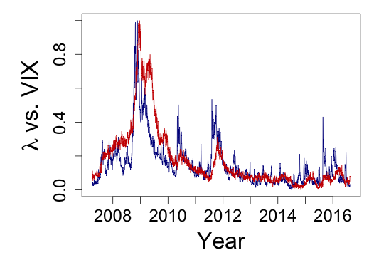
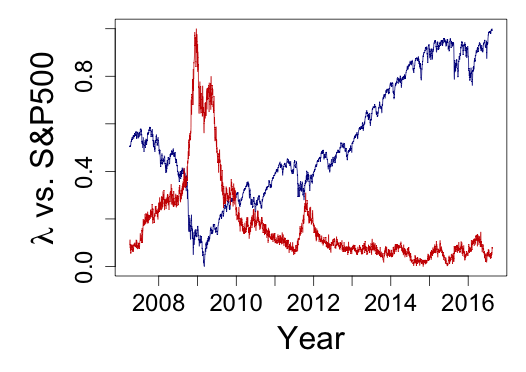
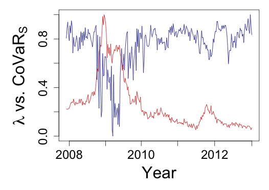
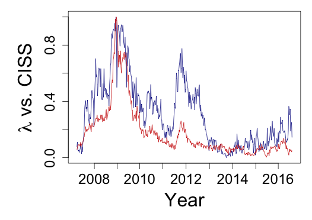
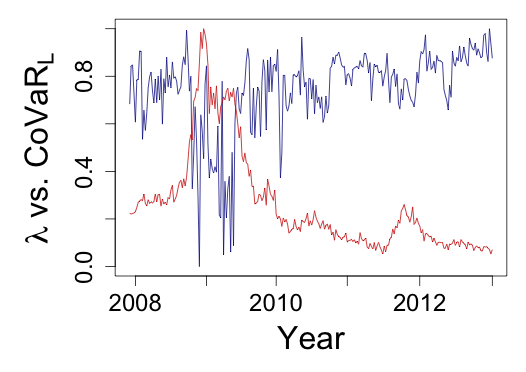
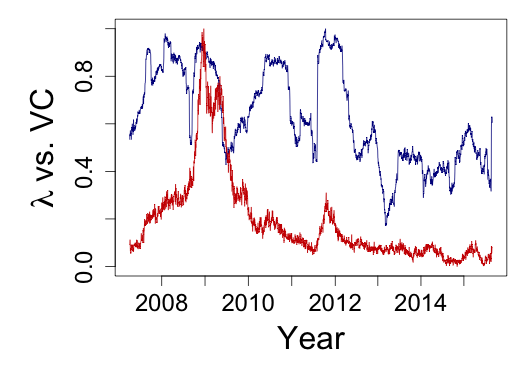

[](http://quantlet.de/index.php?p=info)

## [](http://quantlet.de/) **XFGTVP_LambdaSysRisk** [](http://quantlet.de/d3/ia)

```yaml

Name of Quantlet : XFGTVP_LambdaSysRisk

Published in : Applied Quantitative Finance (3rd Edition)

Description : 'Plots time series of average lambda from quantile LASSO regression computed in
XFGTVP_FRM together with systemic risk measures such as the implied volatility index reported by
the Chicago Board Options Exchange (VIX) and the Standard & Poor"s 500 stock market index (S&P500)
downloaded from Yahoo Finance, CoVaR computed with single index model (CoVaR_S) and linear
regression model (CoVaR_L) from TENET_SIM and TENET_Linear, financial turbulence, the composite
indicator of systemic risk (CISS) downloaded from ECB Statistical Data Warehouse, the volatility
connectedness index (VC) obtained from financialconnectedness.org and credit spread and yield slope
downloaded from Federal Reserve Board. All of the measures including average lambda are normalized
to interval (0,1).'

Keywords : 'quantile, regression, lasso, L1-norm penalty, lasso shrinkage, L1-constraint,
cross-validation, time varying, bic, plot, visualization, historical moving window, nonstationary,
financial, CoVaR, implied-volatility, risk, systemic risk'

See also : 'XFGTVP_LambdaVIX, XFGTVP_LambdaSim, XFGTVP_BetaChange, XFGTVP_FRM, quantilelasso,
http://frm.wiwi.hu-berlin.de, TENET_VaR_CoVaR, TENET_Linear, TENET_SIM, FRM_download_data,
FRM_lambda_series, TVPactiveset, TVPbetanorm, TVPdesign, TVPvariance'

Author : Lenka Zboňáková

Submitted : Thu, September 08 2016 by Lenka Zboňáková

Datafile : 'XFGTVP_FRMoutput.csv, 200_firms_returns_and_scaled_macro_2016-08-18.csv, CISSdata.csv,
CoVaR_sim_l_JPM.csv, VolConn_index.csv, 100_firms_returns_and_macro_2015-04-15.csv'

Example : 'Lambda vs. VIX, Lambda vs. S&P500, Lambda vs. CoVaR_S, Lambda vs. Turbulence, Lambda vs.
CISS, Lambda vs. Credit Spread, Lambda vs. CoVaR_L, Lambda vs. Volatility Connectedness Index,
Lambda vs. Yield Slope'

```
















### R Code:
```r
# Clear all variables and close windows
rm(list = ls(all = TRUE))
graphics.off()

# Set working directory
# setwd("")

# Install and load packages
libraries = c("quantmod")
lapply(libraries, function(x) if (!(x %in% installed.packages())) {
  install.packages(x)} )
lapply(libraries, library, quietly = TRUE, character.only = TRUE)

# Load time series of average lambda
data.lambda  = read.csv("XFGTVP_FRMoutput.csv", sep = ",")
lambda.bic   = data.lambda[, 2]                         # Average lambda chosen by BIC
lambda.gcv   = data.lambda[, 3]                         # Average lambda chosen by GACV
dates.lambda = as.Date(data.lambda[, 1], "%d/%m/%Y")    # Dates for lambda values

# Select dates of beginning and end of time series of lambda
a            = as.Date(dates.lambda[1], "%d/%m/%Y")      
b            = as.Date(dates.lambda[length(lambda.bic)], "%d/%m/%Y")           

# Download historical values of VIX
vix          = as.matrix(getSymbols("^VIX", src = "yahoo", from = a, to = b, 
                                    auto.assign = FALSE)[, 6])  

# Download historical values of S&P500 index
gspc         = as.matrix(getSymbols("^GSPC", src = "yahoo", from = a, to = b, 
                                    auto.assign = FALSE)[, 6])   

# Load values of CoVaR_S and CoVaR_L
w.weekly     = 49                                       # Length of the moving window 
covar.data1  = read.csv("CoVaR_sim_l_JPM.csv", sep = ",")
covar.data2  = read.csv("100_firms_returns_and_macro_2015-04-15.csv", sep = ",")
dates.covar  = as.Date(covar.data2[w.weekly:length(covar.data2[, 1]), 1], "%d/%m/%Y") 
covar.sim    = as.vector(covar.data1[, 1])              # CoVaR_S
covar.lin    = as.vector(covar.data1[, 2])              # CoVaR_L

# Compute financial turbulence
frm.data.tmp = read.csv("200_firms_returns_and_scaled_macro_2016-08-18.csv", sep=",") 
frm.data     = subset(frm.data.tmp, select = c(2:201))  # Data without macro variables
w.daily      = 63                                       # Lenth of the moving window
y            = data.matrix(frm.data)
mu           = as.vector(apply(y, 2, mean))             # Mean for every company
cov          = as.matrix(var(y))                        # Covariance matrix 
tur          = numeric(0)
for (i in 1:dim(y)[1]){
  tur[i] = as.vector(y[i, ] - mu) %*% solve(cov) %*% as.vector(t(y[i, ] - mu))
}
tur          = tur[w.daily:length(tur)]                 # Select dates corresponding 
                                                        # to values of lambda

# Load values of CISS by ECB
ciss.data    = read.csv("CISSdata.csv", sep=",")
dates.ciss   = as.Date(ciss.data[, 1], "%d/%m/%y")
ciss         = ciss.data[, 2]

# Load values Volatility Connectedness index
volcon.data  = read.csv("VolConn_index.csv",sep=",")
dates.volcon = as.Date(volcon.data[, 1], "%m/%d/%Y")
volcon       = volcon.data[, 2]

# Load values of yield curve changes
yield        = as.vector(frm.data.tmp[w.daily:(length(lambda.bic) + w.daily - 1), 206])

# Load values of credit spread
credit       =  as.vector(frm.data.tmp[w.daily:(length(lambda.bic) + w.daily - 1), 207])

# Normalize to interval (0, 1)
lambda.bic.norm = (lambda.bic - min(lambda.bic))/(max(lambda.bic) - min(lambda.bic))
lambda.gcv.norm = (lambda.gcv - min(lambda.gcv))/(max(lambda.gcv) - min(lambda.gcv))
vix.norm        = (vix - min(vix))/(max(vix) - min(vix))
gspc.norm       = (gspc - min(gspc))/(max(gspc) - min(gspc))
covar.sim.norm  = (covar.sim - min(covar.sim))/(max(covar.sim) - min(covar.sim))
covar.lin.norm  = (covar.lin - min(covar.lin))/(max(covar.lin) - min(covar.lin))
tur.norm        = (tur - min(tur))/(max(tur) - min(tur))
ciss.norm       = (ciss - min(ciss))/(max(ciss) - min(ciss))
volcon.norm     = (volcon - min(volcon))/(max(volcon) - min(volcon))
yield.norm      = yield
credit.norm     = credit

# Define common dates for lambda and observations of systemic risk measures
dates.lambda.covar  = as.Date(intersect(dates.covar, dates.lambda))   # Lambda & CoVaR
dates.lambda.ciss   = as.Date(intersect(dates.ciss, dates.lambda))    # Lambda & CISS
dates.lambda.volcon = as.Date(intersect(dates.volcon, dates.lambda))  # Lambda & VC

# Plot settings
par(mar = c(5, 6, 1, 1))
at.values = c(grep("2008", dates.lambda)[1], grep("2009", dates.lambda)[1], 
              grep("2010", dates.lambda)[1], grep("2011", dates.lambda)[1], 
              grep("2012", dates.lambda)[1], grep("2013", dates.lambda)[1], 
              grep("2014", dates.lambda)[1], grep("2015", dates.lambda)[1],
              grep("2016", dates.lambda)[1])
at.covar  = c(grep("2008", dates.lambda.covar)[1], grep("2009", dates.lambda.covar)[1], 
              grep("2010", dates.lambda.covar)[1], grep("2011", dates.lambda.covar)[1], 
              grep("2012", dates.lambda.covar)[1], grep("2013", dates.lambda.covar)[1])
at.ciss   = c(grep("2008", dates.lambda.ciss)[1], grep("2009", dates.lambda.ciss)[1], 
              grep("2010", dates.lambda.ciss)[1], grep("2011", dates.lambda.ciss)[1], 
              grep("2012", dates.lambda.ciss)[1], grep("2013", dates.lambda.ciss)[1], 
              grep("2014", dates.lambda.ciss)[1], grep("2015", dates.lambda.ciss)[1],
              grep("2016", dates.lambda.ciss)[1])
at.volcon = c(grep("2008", dates.lambda.volcon)[1], grep("2009", dates.lambda.volcon)[1], 
              grep("2010", dates.lambda.volcon)[1], grep("2011", dates.lambda.volcon)[1], 
              grep("2012", dates.lambda.volcon)[1], grep("2013", dates.lambda.volcon)[1], 
              grep("2014", dates.lambda.volcon)[1], grep("2015", dates.lambda.volcon)[1])

# Plot lambda vs. VIX
plot(vix.norm, type = "l", col = "darkblue", axes = FALSE, xlab = "Year", frame = TRUE, 
     cex.lab = 2, ylab = expression(paste(lambda, " vs. VIX")))
axis(1, cex.axis = 1.5, labels = c(2008:2016), at = at.values)
axis(2, cex.axis = 1.5)
lines(lambda.bic.norm, col = "red3")

# Plot lambda vs. S&P500
plot(gspc.norm, type = "l", col = "darkblue", axes = FALSE, xlab = "Year", frame = TRUE,  
    cex.lab = 2, ylab = expression(paste(lambda, " vs. S&P500")))
axis(1, cex.axis = 1.5, labels = c(2008:2016), at = at.values)
axis(2, cex.axis = 1.5)
lines(lambda.bic.norm, col = "red3")

# Plot lambda vs. CoVaR_S
# Select values of lambda corresponding to the dates when CoVaR was computed
lambda.weekly.covar = subset(lambda.bic.norm, dates.lambda %in% dates.covar)

# Select values of CoVaR_S corresponding to the dates when lambda was computed
covar.sim.weekly    = subset(covar.sim.norm, dates.covar %in% dates.lambda)

plot(covar.sim.weekly, type = "l", col = "darkblue", axes = FALSE, xlab = "Year", 
     frame = TRUE, cex.lab = 2, ylab = expression(paste(lambda, " vs. CoVaR" [S])))
axis(1, cex.axis = 1.5, labels = c(2008:2013), at = at.covar)
axis(2, cex.axis = 1.5)
lines(lambda.weekly.covar, col = "red3")

# Plot lambda vs. CoVaR__L
# Select values of CoVaR_L corresponding to the dates when lambda was computed
covar.lin.weekly    = subset(covar.lin.norm, dates.covar %in% dates.lambda)

plot(covar.lin.weekly, type = "l", col = "darkblue", axes = FALSE, xlab = "Year", 
     frame = TRUE, cex.lab = 2, ylab = expression(paste(lambda, " vs. CoVaR" [L])))
axis(1, cex.axis = 1.5, labels = c(2008:2013), at = at.covar)
axis(2, cex.axis = 1.5)
lines(lambda.weekly.covar, col = "red3")

# Plot lambda vs. Turbulence
plot(tur.norm, type = "l", col = "darkblue", axes = FALSE, xlab = "Year", frame = TRUE, 
     cex.lab = 2, ylab = expression(paste(lambda, " vs. Turbulence")))
axis(1, cex.axis = 1.5, labels = c(2008:2016), at = at.values)
axis(2, cex.axis = 1.5)
lines(lambda.bic.norm, col = "red3")

# Plot lambda vs. CISS
# Select values of lambda corresponding to the dates when CISS was computed
lambda.weekly.ciss = subset(lambda.bic.norm, dates.lambda %in% dates.ciss)

# Select values of CISS corresponding to the dates when lambda was computed
ciss.weekly        = subset(ciss.norm, dates.ciss %in% dates.lambda)

plot(ciss.weekly, type = "l", col = "darkblue", axes = FALSE, xlab = "Year", frame = TRUE, 
     cex.lab = 2, ylab = expression(paste(lambda, " vs. CISS")))
axis(1, cex.axis = 1.5, labels = c(2008:2016), at = at.ciss)
axis(2, cex.axis = 1.5)
lines(lambda.weekly.ciss, col = "red3")

# Plot lambda vs. Volatility Connectedness index
# Select values of lambda corresponding to the dates when VC was computed
lambda.volcon = subset(lambda.bic.norm, dates.lambda %in% dates.volcon)

# Select values of VC corresponding to the dates when lambda was computed
volcon.new    = subset(volcon.norm, dates.volcon %in% dates.lambda)

plot(volcon.new, type = "l", col = "darkblue", axes = FALSE, xlab = "Year", frame = TRUE,
     cex.lab = 2, ylab = expression(paste(lambda, " vs. VC")), ylim = c(0, 1))
axis(1, cex.axis = 1.5, labels = c(2008:2015), at = at.volcon)
axis(2, cex.axis = 1.5)
lines(lambda.volcon, col = "red3")

# Plot lambda vs. yield curve changes
plot(yield.norm, type = "l", col = "darkblue", axes = FALSE, xlab = "Year", frame = TRUE,
    cex.lab = 2, ylab = expression(paste(lambda, " vs. Yield")))
axis(1, cex.axis = 1.5, labels = c(2008:2016), at = at.values)
axis(2, cex.axis = 1.5)
lines(lambda.bic.norm, col = "red3")

# Plot lambda vs. Credit Spread
plot(credit.norm, type = "l", col = "darkblue", axes = FALSE, xlab = "Year", frame = TRUE, 
     cex.lab = 2, ylab = expression(paste(lambda, " vs. Credit")))
axis(1, cex.axis = 1.5, labels = c(2008:2016), at = at.values)
axis(2, cex.axis = 1.5)
lines(lambda.bic.norm, col = "red3")

```
