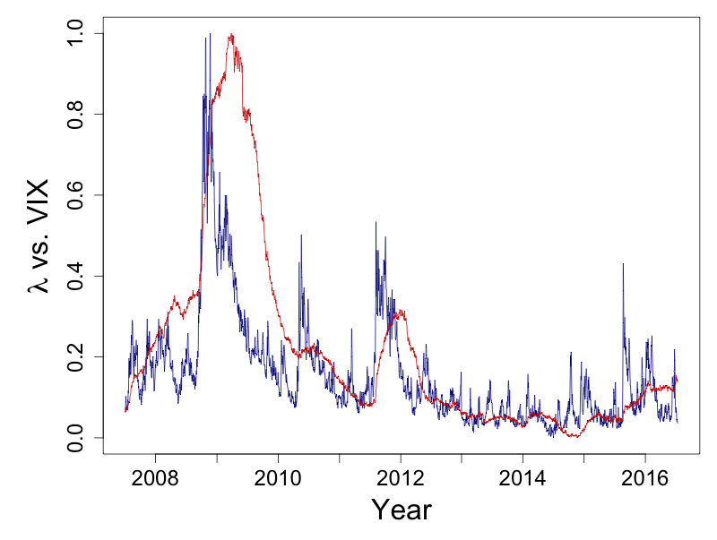

[](http://quantlet.de/index.php?p=info)

## [](http://quantlet.de/) **XFGTVP_LambdaVIX** [](http://quantlet.de/d3/ia)

```yaml

Name of Quantlet : XFGTVP_LambdaVIX

Published in : Applied Quantitative Finance (3rd Edition)

Description : 'Plots time series of average lambda taken from FinancialRiskMeter together with the
implied volatility index reported by the Chicago Board Options Exchange. Daily observations are
collected from 6 July 2007 to 14 July 2016 and normalized to interval (0,1).'

Keywords : 'quantile, regression, lasso, lasso shrinkage, L1-norm penalty, L1-constraint,
volatility, risk measure, systemic risk, nonstationary, time varying, implied-volatility'

See also : 'XFGTVP_LambdaSim, XFGTVP_BetaChange, XFGTVP_FRM, XFGTVP_LambdaSysRisk,
FRM_lambda_series, FRM_download_data, http://frm.wiwi.hu-berlin.de, quantilelasso'

Author : Lenka Zboňáková

Submitted : Thu, September 01 2016 by Lenka Zboňáková

Datafile : lambda_mean_206vars_2016-07-15.csv

```




### R Code:
```r
# Clear all variables
rm(list = ls(all = TRUE))
graphics.off()

# Set working directory
# setwd("")

# Install and load packages
libraries = c("quantmod")
lapply(libraries, function(x) if (!(x %in% installed.packages())) {
  install.packages(x)} )
lapply(libraries, library, quietly = TRUE, character.only = TRUE)

# Read the file with time series of average lambda from FRM
tmpdata = read.csv("lambda_mean_206vars_2016-07-15.csv", sep=",")

# Create vector of (normalized) lambda values and dates
lambda      = tmpdata[, 2]
lambda.norm = (lambda - min(lambda))/(max(lambda) - min(lambda))
dates       = as.Date(tmpdata[, 1], "%Y-%m-%d")

# Download daily VIX values from Yahoo Finance and normalize
start    = dates[1]
end      = dates[length(lambda)]
vix      = as.vector(getSymbols("^VIX", src = "yahoo", from = start, to = end, 
                                auto.assign = FALSE)[, 6])
vix.norm = (vix - min(vix))/(max(vix) - min(vix))

# Plot normalized time series of FRM lambda and VIX
par(mfrow = c(1,1))
par(mar = c(5, 6, 1, 1))
plot(vix.norm, type = "l",  col =  "darkblue", axes = FALSE, 
     xlab = "Year", frame = TRUE, cex.main = 1.5, 
     ylab = expression(paste(lambda, " vs. VIX")), cex.lab = 2)
at.tmp = c(grep("2008", dates)[1], grep("2009", dates)[1], grep("2010", dates)[1], 
           grep("2011", dates)[1], grep("2012", dates)[1], grep("2013", dates)[1], 
           grep("2014", dates)[1], grep("2015", dates)[1], grep("2016", dates)[1])
axis(1, cex.axis = 1.5, labels = c(2008:2016), at = at.tmp)
axis(2, cex.axis = 1.5)
lines(lambda.norm, col = "red3")


```
