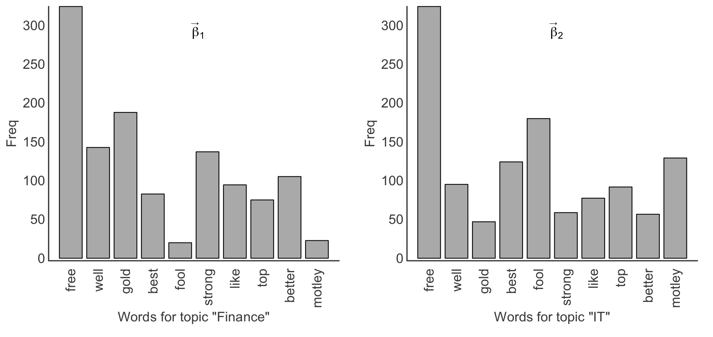

[](http://quantlet.de/)

## [](http://quantlet.de/) **XFGdtmWdistr** [](http://quantlet.de/)

```yaml

Name of Quantlet : XFGdtmWdistr

Published in : Applied Quantitative Finance (3rd Edition)

Description : Plots frequency of words of the NASDAQ data set regarding sectors.

Keywords : plot, graphical representation, visualization, bar chart, text mining

Author : Marco Linton

```




### R Code:
```r
options(stringsAsFactors = FALSE)
setwd("")

data.df         = read.csv2("word_distribution.csv")
data.df$finance = as.numeric(data.df$finance)
data.df$it      = as.numeric(data.df$it)

dev.new(width = 8, height = 3.6)
par(mar = c(5, 3.1, 0.5, 1.1), mfrow = c(1, 2))

barplot(data.df$finance, xaxt = "n", yaxt = "n", yaxs = "i", col = "darkgrey")
box(lwd = 1.5, bty  = "l", col = "gray22")

axis(1, 
     at       = c(0.7, 1.9, 3.1, 4.3, 5.5, 6.7, 7.9, 9.1, 10.3, 11.5),
     labels   = data.df$word,
     cex.axis = 1,
     las      = 2,
     col.axis = "gray22",
     tick     = FALSE,
     line     = -0.5)

axis(side     = 2, 
     tick     = FALSE, 
     cex.lab  = 1, 
     line     = -0.8, 
     col.axis = "gray22",
     las      = 1)

mtext("Freq", 
      side = 2,
      line = 1.8, 
      cex  = 1, 
      col  = "gray22",
      las  = 3)

mtext('Words for topic "Finance"', 
      side = 1,
      line = 3, 
      cex  = 1, 
      col  = "gray22",
      las  = 1)

text(6.3, 290, expression(beta[1]))
text(6.15, 302, "→", cex = 0.6)

barplot(data.df$it, xaxt = "n", yaxt = "n", yaxs = "i", col = "darkgrey")
box(lwd = 1.5, bty  = "l", col = "gray22")


axis(1, 
     at       = c(0.7, 1.9, 3.1, 4.3, 5.5, 6.7, 7.9, 9.1, 10.3, 11.5),
     labels   = data.df$word,
     cex.axis = 1,
     las      = 2,
     col.axis = "gray22",
     tick     = FALSE,
     line     = -0.5)

axis(side     = 2, 
     tick     = FALSE, 
     cex.lab  = 1, 
     line     = -0.8, 
     col.axis = "gray22",
     las      = 1)

mtext("Freq", 
      side = 2,
      line = 1.8, 
      cex  = 1, 
      col  = "gray22",
      las  = 3)

mtext('Words for topic "IT"', 
      side = 1,
      line = 3, 
      cex  = 1, 
      col  = "gray22",
      las  = 1)

text(6.3, 290, expression(beta[2]))
text(6.15, 302, "→", cex = 0.6)

```
