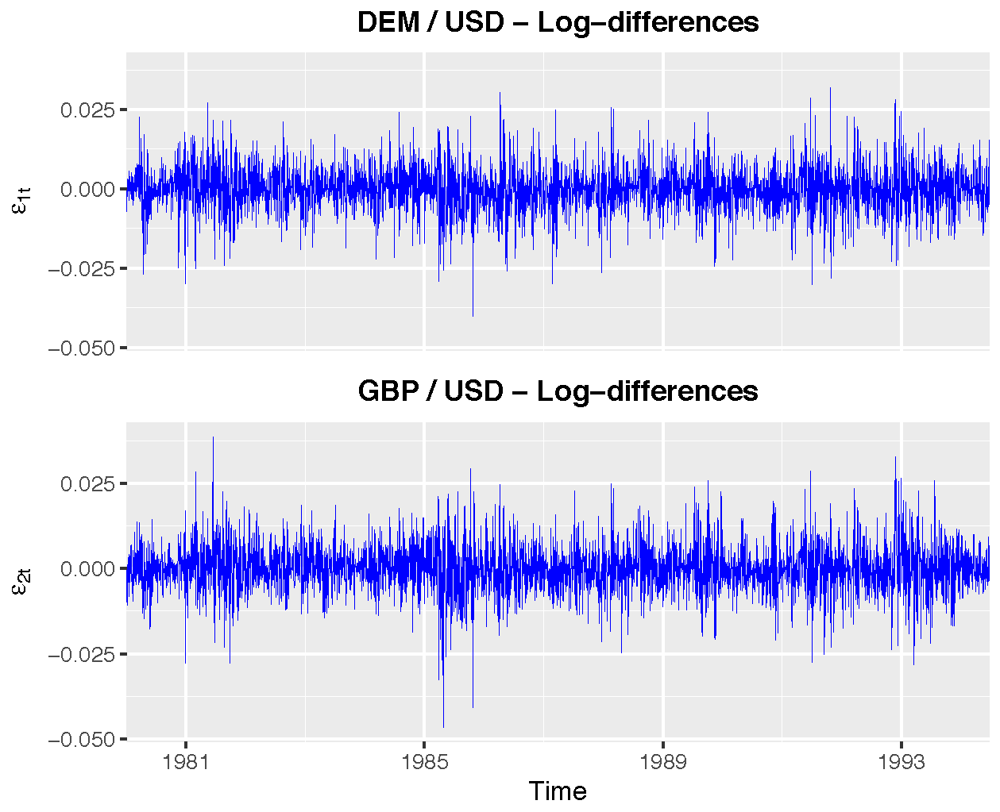

[](http://quantlet.de/)

## [](http://quantlet.de/) **XFGmvol01** [](http://quantlet.de/)

```yaml

Name of Quantlet : XFGmvol01

Published in : Applied Quantitative Finance (3rd Edition)

Description : 'Reads, summarizes and plots the dataset consisting of the DEM/USD and GBP/USD
foreign exchange rates from 31/12/1979 to 01/04/1994.'

Keywords : exchange rates, data, import, summary, plot, graphical representation

Author : Matthias R. Fengler, Helmut Herwartz, Fabian H.C. Raters

Datafile : fx.dat

Output : fxdata.dat, mvolmfxrate.png

```




### R Code:
```r
# load required libraries
library(ggplot2)
library(gridExtra)


# prepare data ------------------------------------------------------------

# read raw data (originally for XploRe) to matrix
fxraw  = readLines("fx.dat")
fxraw  = gsub(" +", " ", fxraw)
fxraw  = gsub("(^ | $)", "", fxraw)
write(fxraw, file = "fxnew.dat", sep = "\n")
fxdata =
    as.matrix(read.delim(
        file   = "fxnew.dat",
        header = FALSE,
        sep    = " ",
        dec    = "."
    ))

# compute log-differences of the exchange rates
n      = nrow(fxdata) - 1
fxdiff = data.frame(date = 1980 + (1:n) / 257,
                    dem  = diff(log(fxdata[, 1])),
                    gbp  = diff(log(fxdata[, 2])))

# store datasets for the following quantlets
save(fxdata, fxdiff, file = "fxdata.dat")

# compute and display summary statistics
summary(fxdiff, digits = 6)
sd(fxdiff$dem)
sd(fxdiff$gbp)


# plot figure 1 -----------------------------------------------------------

maxlim = max(fxdiff$dem, fxdiff$gbp)
minlim = min(fxdiff$dem, fxdiff$gbp)
p1     = ggplot(fxdiff) +
    geom_line(mapping = aes(x = date, y = dem),
              color   = "blue",
              size    = 0.1) +
    scale_x_continuous(breaks = seq(1981, 1993, by = 4), expand = c(0, 0))  +
    scale_y_continuous(limits = c(minlim, maxlim)) +
    ggtitle("DEM / USD - Log-differences") +
    ylab(expression(epsilon[1 * t])) +
    # theme_bw() +
    theme(
        plot.title   = element_text(face = "bold", hjust = 0.5),
        axis.text    = element_text(size = 10),
        axis.title   = element_text(size = 12),
        axis.text.x  = element_blank(),
        axis.ticks.x = element_blank(),
        axis.title.x = element_blank()
    )

p2 = ggplot(fxdiff) +
    geom_line(mapping = aes(x = date, y = gbp),
              color   = "blue",
              size    = 0.1) +
    scale_x_continuous(breaks = seq(1981, 1993, by = 4), expand = c(0, 0)) +
    scale_y_continuous(limits = c(minlim, maxlim)) +
    ggtitle("GBP / USD - Log-differences") +
    ylab(expression(epsilon[2 * t])) +
    xlab("Time") +
    # theme_bw() +
    theme(
        plot.title = element_text(face = "bold", hjust = 0.5),
        axis.text  = element_text(size = 10),
        axis.title = element_text(size = 12)
    )

p = grid.arrange(p1, p2, nrow = 2, heights = c(1, 1.2))

# optionally, export figure to pdf
ggsave("mvolmfxrate.pdf", p, width = 16, height = 13, units = "cm")

```
