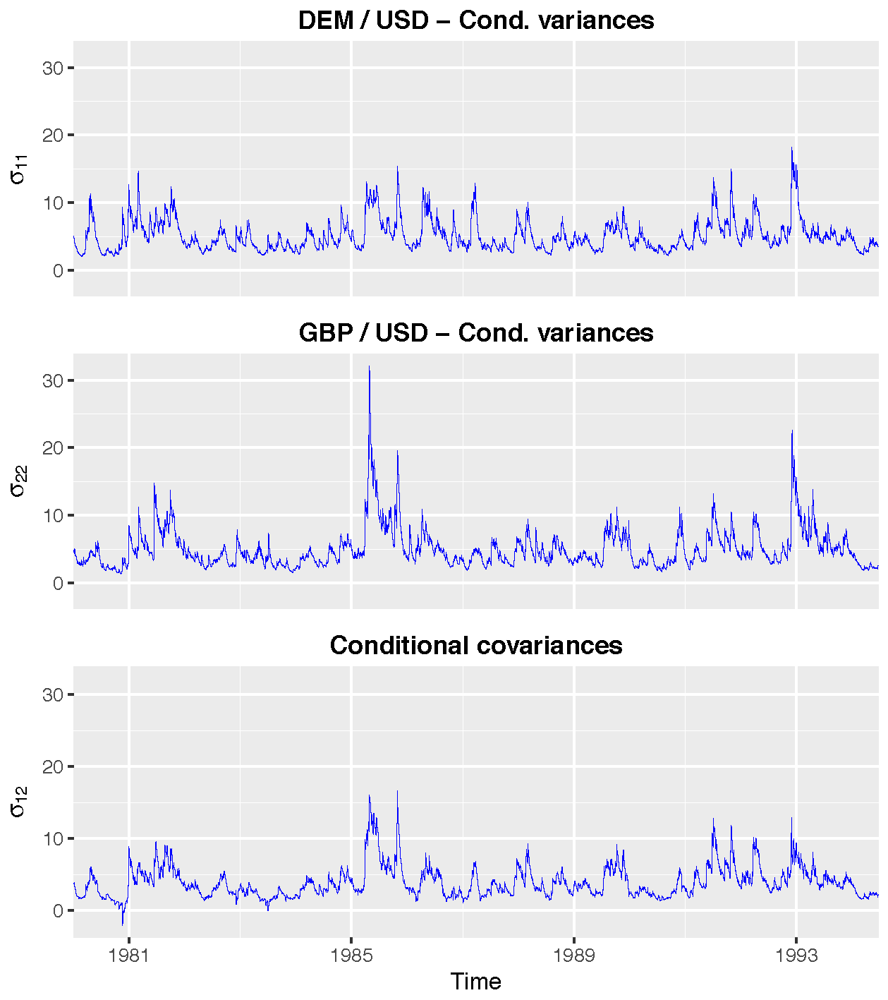

[](http://quantlet.de/)

## [](http://quantlet.de/) **XFGmvol02** [](http://quantlet.de/)

```yaml

Name of Quantlet : XFGmvol02

Published in : Applied Quantitative Finance (3rd Edition)

Description : Estimates the bivariate GARCH model, its (co)variance processes and plots them.

Keywords : bigarch, BEKK, estimation, plot, graphical representation

See also : XFGmvol01

Author : Matthias R. Fengler, Helmut Herwartz, Fabian H.C. Raters

Datafile : fxdata.dat

Output : estimates.dat, sigmaest.dat, mvolmcovar.png

```




### R Code:
```r
# load required libraries
library(ggplot2)
library(gridExtra)

# load bivariate GARCH estimation function
bigarch = NULL
source("bigarch.R")

# load stored datasets
fxdiff = NULL
load("fxdata.dat")


# prepare data ------------------------------------------------------------

# estimate coefficients and display them with the corresponding
# loglikelihood value
returns = as.matrix(fxdiff[-1])
theta   = c(0.28, -0.06, -0.05, 0.2, 0.9, 0.03, 0.02, 0.9)
res     = bigarch(theta, returns)
coeff   = res$coeff
res

# set up coefficient matrices with estimates and display them
C = matrix(c(coeff[1], 0, coeff[2:3]), 2)
A = matrix(coeff[4:7], 2)
G = matrix(coeff[8:11], 2)
C
A
G

# store coefficient matrices for the following quantlets
save(C, A, G, file = "estimates.dat")


# receive estimated (co)variance processes --------------------------------

# estimate unconditional covariance matrix
n        = nrow(returns)
sigma0   = (t(returns) %*% returns) / n

sigma11  = c(sigma0[1, 1], numeric(n - 1))
sigma12  = c(sigma0[1, 2], numeric(n - 1))
sigma22  = c(sigma0[2, 2], numeric(n - 1))

sigmaold = sigma0
CC       = t(C) %*% C
for (i in 2:n) {
    E          = returns[i - 1,] %*% t(returns[i - 1,])
    sigmai     = CC + t(A) %*% E %*% A + t(G) %*% sigmaold %*% G
    sigma11[i] = sigmai[1, 1]
    sigma12[i] = sigmai[1, 2]
    sigma22[i] = sigmai[2, 2]
    sigmaold   = sigmai
}

factor   = 1e5
sigmaest = data.frame(
    date    = fxdiff$date,
    sigma11 = sigma11 * factor,
    sigma22 = sigma22 * factor,
    sigma12 = sigma12 * factor
)

# store the estimated processes for the following quantlets
save(sigmaest, file = "sigmaest.dat")


# plot figure 2 -----------------------------------------------------------

maxlim = max(sigmaest$sigma11, sigmaest$sigma22, sigmaest$sigma12)
minlim = min(sigmaest$sigma11, sigmaest$sigma22, sigmaest$sigma12)
p1     = ggplot(sigmaest) +
    geom_line(
        mapping = aes(x = date, y = sigma11),
        color   = "blue",
        size    = 0.2
    ) +
    scale_x_continuous(breaks = seq(1981, 1993, by = 4), expand = c(0, 0))  +
    scale_y_continuous(limits = c(minlim, maxlim)) +
    ggtitle("DEM / USD - Cond. variances") +
    ylab(expression(sigma[11])) +
    # theme_bw() +
    theme(
        plot.title   = element_text(face = "bold", hjust = 0.5),
        axis.text    = element_text(size = 10),
        axis.title   = element_text(size = 12),
        axis.text.x  = element_blank(),
        axis.ticks.x = element_blank(),
        axis.title.x = element_blank()
    )

p2 = ggplot(sigmaest) +
    geom_line(
        mapping = aes(x = date, y = sigma22),
        color   = "blue",
        size    = 0.2
    ) +
    scale_x_continuous(breaks = seq(1981, 1993, by = 4), expand = c(0, 0))  +
    scale_y_continuous(limits = c(minlim, maxlim)) +
    ggtitle("GBP / USD - Cond. variances") +
    ylab(expression(sigma[22])) +
    # theme_bw() +
    theme(
        plot.title   = element_text(face = "bold", hjust = 0.5),
        axis.text    = element_text(size = 10),
        axis.title   = element_text(size = 12),
        axis.text.x  = element_blank(),
        axis.ticks.x = element_blank(),
        axis.title.x = element_blank()
    )

p3 = ggplot(sigmaest) +
    geom_line(
        mapping = aes(x = date, y = sigma12),
        color   = "blue",
        size    = 0.2
    ) +
    scale_x_continuous(breaks = seq(1981, 1993, by = 4), expand = c(0, 0)) +
    scale_y_continuous(limits = c(minlim, maxlim)) +
    ggtitle("Conditional covariances") +
    ylab(expression(sigma[12])) +
    xlab("Time") +
    # theme_bw() +
    theme(
        plot.title = element_text(face = "bold", hjust = 0.5),
        axis.text  = element_text(size = 10),
        axis.title = element_text(size = 12)
    )

p = grid.arrange(p1, p2, p3, nrow = 3, heights = c(1, 1, 1.2))

# optionally, export figure to pdf
ggsave("mvolmcovar.pdf", p, width = 16, height = 18, units = "cm")

```
