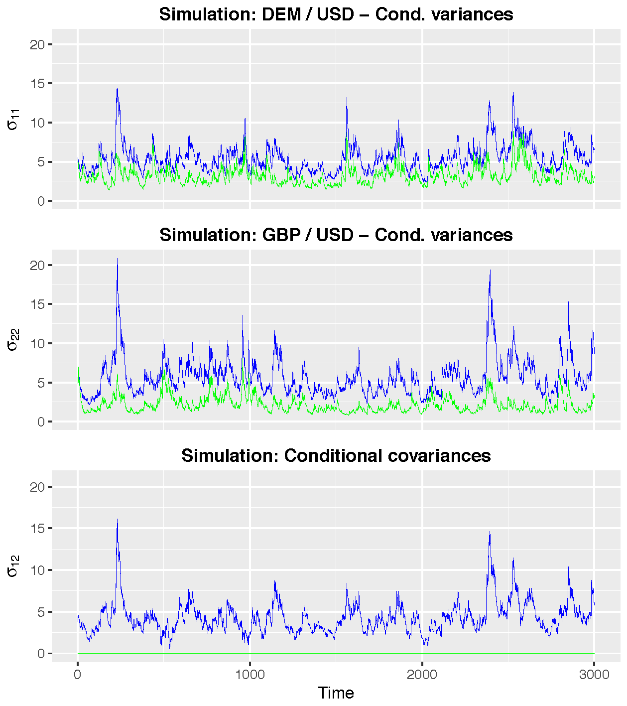

[](http://quantlet.de/)

## [](http://quantlet.de/) **XFGmvol03** [](http://quantlet.de/)

```yaml

Name of Quantlet : XFGmvol03

Published in : Applied Quantitative Finance (3rd Edition)

Description : 'Uses the estimated parameters from XFGmvol02 to simulate and plot (co)variance
processes for the BEKK-type model and a bivariate process where the covariance and the interaction
terms are set to zero.'

Keywords : bigarch, BEKK, simulation, zero interaction, plot, graphical representation

See also : XFGmvol02

Author : Matthias R. Fengler, Helmut Herwartz, Fabian H.C. Raters

Datafile : fxdata.dat, estimates.dat

Output : mvolmcovarsimul.png

```




### R Code:
```r
# load required libraries
library(ggplot2)
library(gridExtra)

# load stored datasets
fxdiff = NULL
load("fxdata.dat")

# load stored coefficient matrices
C = NULL
A = NULL
G = NULL
load("estimates.dat")


# prepare data ------------------------------------------------------------

set.seed(0)

# simulate the standard normally distributed innovations
n  = 3000
xi = matrix(rnorm(n * 2), 2)

# estimate unconditional covariance matrix
returns = as.matrix(fxdiff[-1])
sigma0  = (t(returns) %*% returns) / nrow(returns)


# simulate bivariate processes --------------------------------------------

# initialize with unconditional (co)variances
sigma11  = c(sigma0[1, 1], numeric(n - 1))
sigma12  = c(sigma0[1, 2], numeric(n - 1))
sigma22  = c(sigma0[2, 2], numeric(n - 1))

sigmaold = sigma0
CC       = t(C) %*% C
for (i in 2:n) {
    x          = svd(sigmaold)
    sigmasqr   = x$u %*% diag(sqrt(x$d)) %*% t(x$u)
    
    r          = sigmasqr %*% xi[, i]
    E          = r %*% t(r)
    
    sigmai     = CC + t(A) %*% E %*% A + t(G) %*% sigmaold %*% G
    sigma11[i] = sigmai[1, 1]
    sigma12[i] = sigmai[1, 2]
    sigma22[i] = sigmai[2, 2]
    sigmaold   = sigmai
}


# simulate two univariate processes ---------------------------------------

# restrict coefficient matrices to be diagonal
uCC      = diag(diag(t(C) %*% C))
uA       = diag(diag(A))
uG       = diag(diag(G))

usigma11 = c(sigma0[1, 1], numeric(n - 1))
usigma12 = numeric(n)
usigma22 = c(sigma0[2, 2], numeric(n - 1))
sigmaold = diag(diag(sigma0))
for (i in 2:n) {
    sigmasqr    = sqrt(sigmaold)
    
    r           = sigmasqr %*% xi[, i]
    E           = diag(diag(r %*% t(r)))
    
    sigmai      = uCC + uA %*% E %*% uA + uG %*% sigmaold %*% uG # t(uA) == uA
    usigma11[i] = sigmai[1, 1]
    # usigma12[i] = sigmai[1, 2] # not necessary; just for studying
    usigma22[i] = sigmai[2, 2]
    sigmaold    = sigmai
}

factor   = 1e5
sigmasim = data.frame(
    date     = 1:n,
    sigma11  = sigma11 * factor,
    sigma22  = sigma22 * factor,
    sigma12  = sigma12 * factor,
    usigma11 = usigma11 * factor,
    usigma22 = usigma22 * factor,
    usigma12 = usigma12 * factor
)


# plot figure 3 -----------------------------------------------------------

maxlim = max(
    sigmasim$sigma11,
    sigmasim$sigma22,
    sigmasim$sigma12,
    sigmasim$usigma11,
    sigmasim$usigma22,
    sigmasim$usigma12
)
minlim = min(
    sigmasim$sigma11,
    sigmasim$sigma22,
    sigmasim$sigma12,
    sigmasim$usigma11,
    sigmasim$usigma22,
    sigmasim$usigma12
)

p1 = ggplot(sigmasim) +
    geom_line(
        mapping = aes(x = date, y = sigma11),
        color   = "blue",
        size    = 0.2
    ) +
    geom_line(
        mapping = aes(x = date, y = usigma11),
        color   = "green",
        size    = 0.2
    ) +
    scale_y_continuous(limits = c(minlim, maxlim)) +
    ggtitle("Simulation: DEM / USD - Cond. variances") +
    ylab(expression(sigma[11])) +
    # theme_bw() +
    theme(
        plot.title   = element_text(face = "bold", hjust = 0.5),
        axis.text    = element_text(size = 10),
        axis.title   = element_text(size = 12),
        axis.text.x  = element_blank(),
        axis.ticks.x = element_blank(),
        axis.title.x = element_blank()
    )

p2 = ggplot(sigmasim) +
    geom_line(
        mapping = aes(x = date, y = sigma22),
        color   = "blue",
        size    = 0.2
    ) +
    geom_line(
        mapping = aes(x = date, y = usigma22),
        color   = "green",
        size    = 0.2
    ) +
    scale_y_continuous(limits = c(minlim, maxlim)) +
    ggtitle("Simulation: GBP / USD - Cond. variances") +
    ylab(expression(sigma[22])) +
    # theme_bw() +
    theme(
        plot.title   = element_text(face = "bold", hjust = 0.5),
        axis.text    = element_text(size = 10),
        axis.title   = element_text(size = 12),
        axis.text.x  = element_blank(),
        axis.ticks.x = element_blank(),
        axis.title.x = element_blank()
    )

p3 = ggplot(sigmasim) +
    geom_line(
        mapping = aes(x = date, y = sigma12),
        color   = "blue",
        size    = 0.2
    ) +
    geom_line(
        mapping = aes(x = date, y = usigma12),
        color   = "green",
        size    = 0.2
    ) +
    scale_y_continuous(limits = c(minlim, maxlim)) +
    ggtitle("Simulation: Conditional covariances") +
    ylab(expression(sigma[12])) +
    xlab("Time") +
    # theme_bw() +
    theme(
        plot.title = element_text(face = "bold", hjust = 0.5),
        axis.text  = element_text(size = 10),
        axis.title = element_text(size = 12)
    )

p = grid.arrange(p1, p2, p3, nrow = 3, heights = c(1, 1, 1.2))

# optionally, export figure to pdf
ggsave("mvolmcovarsimul.pdf", p, width = 16, height = 18, units = "cm")

```
